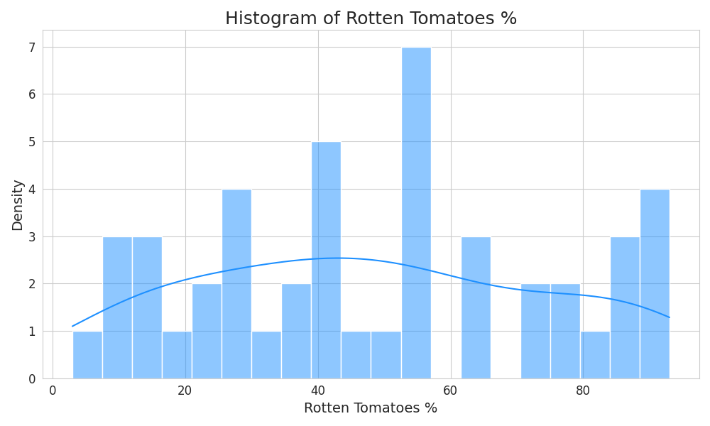

# Movie Dataset Summary

## Summary Statistics
|    | describe   | Film                 | Genre   | Lead Studio      |   Audience score % |   Profitability |   Rotten Tomatoes % | Worldwide Gross   |       Year |
|---:|:-----------|:---------------------|:--------|:-----------------|-------------------:|----------------:|--------------------:|:------------------|-----------:|
|  0 | count      | 46                   | 46      | 46               |            46      |        46       |             46      | 46                |   46       |
|  1 | null_count | 0                    | 0       | 0                |             0      |         0       |              0      | 0                 |    0       |
|  2 | mean       |                      |         |                  |            64.1957 |         5.13884 |             48.3261 |                   | 2009.07    |
|  3 | std        |                      |         |                  |            13.0718 |        10.0385  |             26.6192 |                   |    1.43608 |
|  4 | min        | (500) Days of Summer | Action  | 20th Century Fox |            40      |         0       |              3      | $10.70            | 2007       |
|  5 | 25%        |                      |         |                  |            52      |         1.81767 |             27      |                   | 2008       |
|  6 | 50%        |                      |         |                  |            63      |         2.64235 |             48      |                   | 2009       |
|  7 | 75%        |                      |         |                  |            76      |         5.10312 |             71      |                   | 2010       |
|  8 | max        | P.S. I Love You      | romance | Warner Bros.     |            89      |        66.934   |             93      | $96.16            | 2011       |

